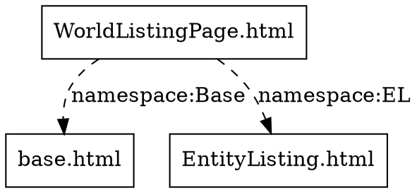

# Command Line Interface

Templar provides a unified CLI tool for serving templates, debugging dependencies, and managing external template sources.

## Installation

```bash
go install github.com/panyam/templar/cmd/templar@latest
```

Or build from source:

```bash
git clone https://github.com/panyam/templar
cd templar
go build ./cmd/templar
```

## Commands Overview

```
┌─────────────────────────────────────────────────────────────────────────────┐
│  templar <command> [flags]                                                  │
│                                                                             │
│  Commands:                                                                  │
│  ┌──────────────┬─────────────────────────────────────────────────────────┐ │
│  │ serve        │ Start HTTP server to serve and test templates           │ │
│  │ debug        │ Analyze template dependencies and debug issues          │ │
│  │ get          │ Fetch external template sources (vendoring)             │ │
│  │ version      │ Print version information                               │ │
│  └──────────────┴─────────────────────────────────────────────────────────┘ │
│                                                                             │
│  Global Flags:                                                              │
│  --config string    Config file (default: .templar.yaml)                    │
└─────────────────────────────────────────────────────────────────────────────┘
```

## `templar serve` - HTTP Template Server

Start an HTTP server to serve and test templates during development.

### Usage

```bash
templar serve [flags]
```

### Flags

| Flag | Short | Default | Description |
|------|-------|---------|-------------|
| `--addr` | `-a` | `:7777` | Address where the HTTP server will run |
| `--template` | `-t` | | Template directories to load templates from (repeatable) |
| `--static` | `-s` | | Static directories in format `<http_prefix>:<local_folder>` (repeatable) |

### Examples

```bash
# Basic usage - serve templates from ./templates on port 7777
templar serve -t ./templates

# Multiple template directories (searched in order)
templar serve -t ./templates -t ../shared/templates

# Custom port
templar serve --addr :8080 -t ./templates

# With static file serving
templar serve -t ./templates -s /static:./public -s /css:./styles

# Full example
templar serve --addr :3000 \
  -t ./templates \
  -t ../shared/templates \
  -s /static:./public \
  -s /css:./styles \
  -s /js:./scripts
```

### How It Works

```
┌─────────────────────────────────────────────────────────────────────────────┐
│  Browser Request: GET /pages/dashboard.html                                 │
│                                                                             │
│  ┌───────────────────────────────────────────────────────────────────────┐  │
│  │  1. Check ./templates/pages/dashboard.html                            │  │
│  │  2. Check ../shared/templates/pages/dashboard.html                    │  │
│  │  3. Found → Load, parse includes/namespaces, render                   │  │
│  │  4. Return rendered HTML                                              │  │
│  └───────────────────────────────────────────────────────────────────────┘  │
│                                                                             │
│  Browser Request: GET /static/app.js                                        │
│                                                                             │
│  ┌───────────────────────────────────────────────────────────────────────┐  │
│  │  1. Match prefix /static                                              │  │
│  │  2. Map to ./public/app.js                                            │  │
│  │  3. Serve static file                                                 │  │
│  └───────────────────────────────────────────────────────────────────────┘  │
└─────────────────────────────────────────────────────────────────────────────┘
```

## `templar debug` - Template Analyzer

Analyze template files for dependencies, cycles, definitions, and references. Essential for debugging complex template hierarchies.

### Usage

```bash
templar debug [flags] <template-file>
```

### Flags

| Flag | Short | Default | Description |
|------|-------|---------|-------------|
| `--path` | `-p` | `.` | Comma-separated search paths for templates |
| `--verbose` | `-v` | `false` | Show verbose output (line numbers, etc.) |
| `--defines` | | `false` | Show all template definitions |
| `--refs` | | `false` | Show all template references |
| `--cycles` | | `true` | Detect dependency cycles |
| `--dot` | | `false` | Output GraphViz DOT format |
| `--flatten` | | `false` | Output flattened/preprocessed template |
| `--trace` | | `false` | Trace path resolution for includes |

### Examples

```bash
# Basic analysis - show dependency tree and cycle detection
templar debug -p templates homepage.html

# Show all template definitions across files
templar debug --defines -p templates homepage.html

# Show all template references ({{ template "X" }} calls)
templar debug --refs -p templates homepage.html

# Show both definitions and references
templar debug --defines --refs -p templates homepage.html

# Verbose mode - includes line numbers
templar debug -v -p templates homepage.html

# Multiple search paths
templar debug -p templates,../shared,./components homepage.html

# Output GraphViz DOT format for visualization
templar debug --dot -p templates homepage.html > deps.dot
dot -Tpng deps.dot -o deps.png

# Flatten template - expand all includes and show preprocessed output
templar debug --flatten -p templates homepage.html

# Trace path resolution - debug include path issues
templar debug --trace -p templates homepage.html
```

### Output Modes

#### Default Output (Dependency Tree)

```
$ templar debug -p templates WorldListingPage.html

Analyzing: WorldListingPage.html
Search paths: [templates]

=== Dependency Tree ===
WorldListingPage.html
  +- namespace "Base" "layouts/base.html"
  |  base.html
  |     +- include "components/header.html"
  |     |  header.html
  |     +- include "components/footer.html"
  |     |  footer.html
  +- namespace "EL" "components/EntityListing.html"
  |  EntityListing.html
  |     +- include "components/grid.html"
  |     |  grid.html
  +- extend "EL:EntityListing" -> "WorldListing"
  |    \- rewire "EL:GridCardPreview" -> "worldPreview"

=== Cycle Detection ===
No cycles detected in include/namespace graph.

=== Extension Analysis ===
No extension issues detected.

=== Summary ===
Total templates analyzed: 5
Total definitions: 12
Total references: 18
```

#### With `--defines`

```
=== Template Definitions ===
WorldListingPage.html:
  - WorldListingPage
  - worldPreview
base.html:
  - base
  - content
  - title
EntityListing.html:
  - EntityListing
  - Grid
  - GridCardPreview
```

#### With `--refs`

```
=== Template References ===
WorldListingPage.html:
  → Base:base
  → worldPreview
base.html:
  → content
  → header
  → footer
EntityListing.html:
  → Grid
  → GridCardPreview
```

#### With `--dot` (GraphViz)



Generate visualization:
```bash
templar debug --dot -p templates homepage.html > deps.dot
dot -Tpng deps.dot -o deps.png
# or for SVG (scalable)
dot -Tsvg deps.dot -o deps.svg
```

#### With `--flatten`

Shows the preprocessed template with all includes expanded:

```bash
$ templar debug --flatten -p templates WorldListingPage.html

{{ define "Base:base" }}
<html>
  <head>{{ template "Base:title" . }}</head>
  <body>
    {{ template "Base:header" . }}
    {{ template "Base:content" . }}
    {{ template "Base:footer" . }}
  </body>
</html>
{{ end }}

{{ define "EL:EntityListing" }}
...
{{ end }}

{{ define "WorldListingPage" }}
{{ template "WorldListing" . }}
{{ end }}

=== Extensions (will create templates at render time) ===
  - EL:EntityListing -> WorldListing
      rewire: EL:GridCardPreview -> worldPreview
```

#### With `--trace`

Shows how template paths are resolved:

```
$ templar debug --trace -p templates WorldListingPage.html

-> Loading "WorldListingPage.html"
  OK Resolved to: /path/to/templates/WorldListingPage.html
  -> Loading "layouts/base.html" (from: WorldListingPage.html)
    OK Resolved to: /path/to/templates/layouts/base.html
    -> Loading "components/header.html" (from: base.html)
      OK Resolved to: /path/to/templates/components/header.html
```

## `templar get` - Fetch External Sources

Fetch template dependencies from external sources (GitHub repositories, etc.) for vendoring.

### Usage

```bash
templar get [flags] [source...]
```

### Flags

| Flag | Default | Description |
|------|---------|-------------|
| `--update` | `false` | Update to latest versions matching refs |
| `--verify` | `false` | Verify local files match lock file |
| `--dry-run` | `false` | Show what would be fetched without fetching |

### Examples

```bash
# Fetch all configured sources
templar get

# Update all sources to latest versions
templar get --update

# Fetch only a specific source
templar get @goapplib

# Verify local files match lock file
templar get --verify

# Show what would be fetched
templar get --dry-run
```

### Configuration

Requires a `templar.yaml` configuration file. See [vendoring.md](vendoring.md) for full details.

```yaml
sources:
  goapplib:
    url: github.com/panyam/goapplib
    path: templates
    ref: v1.2.0

vendor_dir: ./templar_modules
search_paths:
  - ./templates
  - ./templar_modules
```

## `templar version` - Version Information

Print version, build, and runtime information.

```bash
$ templar version

templar v1.0.0
  commit:  abc123def456
  built:   2024-12-08T10:30:00Z
  go:      go1.21.0
  os/arch: darwin/arm64
```

## Configuration File

Templar supports YAML configuration files to set default values for commands.

### Config File Locations (in order of precedence)

1. `--config` flag (explicit path)
2. `.templar.yaml` in current directory
3. `~/.config/templar/config.yaml` (user defaults)

### Complete Configuration Reference

```yaml
# Serve command configuration
serve:
  addr: ":8080"                    # Server address
  templates:                       # Template directories
    - ./templates
    - ../shared/templates
  static:                          # Static file mappings
    - /static:./public
    - /css:./styles
    - /js:./scripts

# Debug command configuration
debug:
  path: "templates,../shared"      # Search paths (comma-separated)
  verbose: false                   # Verbose output
  cycles: true                     # Cycle detection
  defines: false                   # Show definitions
  refs: false                      # Show references

# Vendoring configuration
sources:
  goapplib:
    url: github.com/panyam/goapplib
    path: templates
    ref: v1.2.0

vendor_dir: ./templar_modules
search_paths:
  - ./templates
  - ./templar_modules

# Global settings
verbose: false                     # Show config file being used
```

### Example Configurations

#### Development Configuration (`.templar.yaml`)

```yaml
serve:
  addr: ":3000"
  templates:
    - ./templates
    - ./templar_modules
  static:
    - /assets:./public

debug:
  path: "templates,templar_modules"
  verbose: true
```

#### User Defaults (`~/.config/templar/config.yaml`)

```yaml
# Personal defaults applied to all projects
debug:
  verbose: true
  defines: true
```

## Environment Variables

All configuration options can be set via environment variables with the `TEMPLAR_` prefix:

```bash
# Serve command
export TEMPLAR_SERVE_ADDR=":8080"
export TEMPLAR_SERVE_TEMPLATES="./templates,../shared"

# Debug command
export TEMPLAR_DEBUG_PATH="templates"
export TEMPLAR_DEBUG_VERBOSE="true"

# Run commands - env vars are picked up automatically
templar serve
templar debug homepage.html
```

### Precedence Order

1. Command-line flags (highest priority)
2. Environment variables
3. Config file values
4. Default values (lowest priority)

## Building with Version Info

When building templar from source, embed version information using ldflags:

```bash
# Basic build with version info
go build -ldflags "\
  -X main.Version=1.0.0 \
  -X main.GitCommit=$(git rev-parse HEAD) \
  -X main.BuildDate=$(date -u +%Y-%m-%dT%H:%M:%SZ)" \
  ./cmd/templar

# Example Makefile target
VERSION ?= $(shell git describe --tags --always --dirty)
COMMIT  ?= $(shell git rev-parse HEAD)
DATE    ?= $(shell date -u +%Y-%m-%dT%H:%M:%SZ)

build:
	go build -ldflags "\
		-X main.Version=$(VERSION) \
		-X main.GitCommit=$(COMMIT) \
		-X main.BuildDate=$(DATE)" \
		-o bin/templar ./cmd/templar
```

## Common Workflows

### Development Server

```bash
# Start server with hot template reloading
templar serve -t templates -s /static:public

# Visit http://localhost:7777/pages/index.html
```

### Debugging Template Issues

```bash
# 1. Check dependency tree
templar debug -p templates problematic.html

# 2. Look for cycles
templar debug --cycles -p templates problematic.html

# 3. Verify template definitions exist
templar debug --defines -p templates problematic.html

# 4. Trace path resolution
templar debug --trace -p templates problematic.html

# 5. See preprocessed output
templar debug --flatten -p templates problematic.html
```

### Setting Up Vendoring

```bash
# 1. Create templar.yaml with sources
cat > templar.yaml << 'EOF'
sources:
  uikit:
    url: github.com/example/uikit
    path: templates
    ref: v1.0.0

vendor_dir: ./templar_modules
search_paths:
  - ./templates
  - ./templar_modules
EOF

# 2. Fetch dependencies
templar get

# 3. Verify setup
templar debug --trace -p templates,templar_modules mypage.html
```

### CI/CD Integration

```yaml
# .github/workflows/build.yml
jobs:
  build:
    steps:
      - uses: actions/checkout@v4

      - name: Setup Go
        uses: actions/setup-go@v5
        with:
          go-version: '1.21'

      - name: Install templar
        run: go install github.com/panyam/templar/cmd/templar@latest

      - name: Fetch template dependencies
        run: templar get --verify || templar get

      - name: Validate templates
        run: |
          for tmpl in templates/pages/*.html; do
            templar debug --cycles -p templates,templar_modules "$tmpl"
          done

      - name: Build
        run: go build ./...
```
